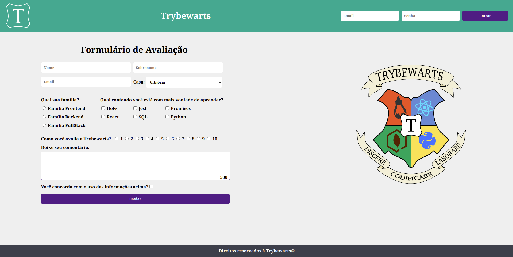

# Trybewarts



# Contexto
Este projeto foi feito em dupla, onde foi desenvolvido uma página de formulário da Escola de Magia de Trybewarts, em que as pessoas estudantes poderão enviar seus feedbacks sobre ela. O tema desse projeto é baseado na obra 'Harry Potter', de J. K. Rowling, já que programar é o mais próximo que podemos chegar de algo verdadeiramente mágico!
O objetivo deste projeto é consolidar o conhecimento adquirido sobre criação de formulários, posicionamento de objetos na tela, e a prática de pair-programing.

## Habilidades Desenvolvidas

- Criar formulários em HTML;
- Utilizar CSS Flexbox para criar layouts flexíveis;

---

## Ferramentas utilizadas

> Linguagem: `HTML/CSS, Javascript`

## Para clonar esse repositório:
1 - **Clonar projeto locamente**
```bash
git clone git@github.com:imgeff/trybewarts.git
```

## Instalando Dependências

2 - **Entrar na  pasta do projeto**
```bash
cd trybewarts
```
3 - **Instalar Dependências**
```bash
npm install
```

## Executando aplicação

* Para rodar a aplicação:

 - Baixe a extênsão `liveServer`
 - Clique com o botão direito no arquivo `index.html`e escolha a opção `Open with Live Server`

## 🤝 Colaboradores

Agradecemos às seguintes pessoas que contribuíram para este projeto:

<table>
  <tr>
    <td align="center">
      <a href="#">
        <br>
        <sub>
          <b>Gefferson Batista</b>
        </sub>
      </a>
    </td>
    <td align="center">
      <a href="#">
        <br>
        <sub>
          <b>João Vitor Dantas</b>
        </sub>
      </a>
    </td>
  </tr>
</table>

